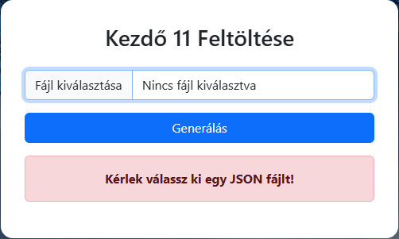
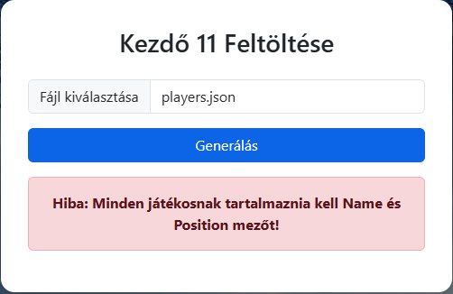
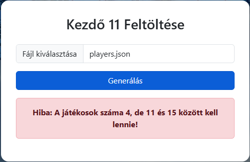
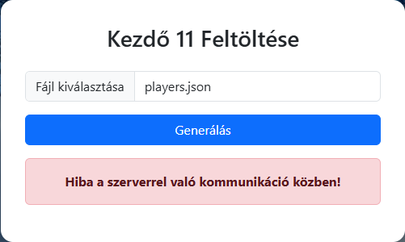

# 🏅 Kezdőcsapat

A program készítsen el lehetséges kezdő 11 összeállításokat egy focicsapatból.

## 📋 Funkciók

✅ Különböző értelmes felállások (pl. 4-4-2, 4-3-3, 3-5-2) generálása  
✅ Kezdőcsapat variációk összeállítása a játékosok alapján  
✅ A szerver jóság értéket társít az egyes variációkhoz  
✅ Kliens oldali megjelenítés Bootstrap kártyákkal  
✅ A kártyák színe a csapatfelállás jósága alapján változik:
- **zöld** → legjobb felállás (>95%)
- **narancs** → közepes felállás (>75%)
- **piros** → rossz felállás (≤75%)

## 📥 Bemenetek

- Egy focicsapat játékosai (cserékkel együtt)
- Játékosok posztja

## 📤 Kimenetek

- Lehetséges kezdő felállások jóság értékkel

## 🖼️ Tesztesetek

### Hibás formátum

- Fájlformátum nem megfelelő
- Nem lett fájl csatolva

### Hibás bemenő adat

- Hiányos tulajdonságok

### Nincs elegedő játékos

- Legalább 11 játékosra van szükség

### Szerveroldali hiba

- Backend nem válaszol

